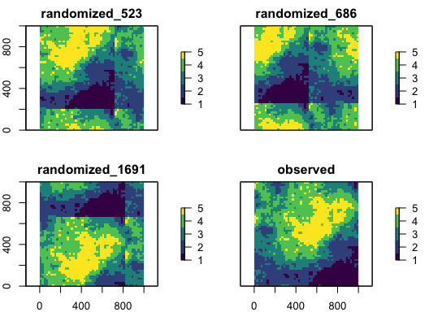
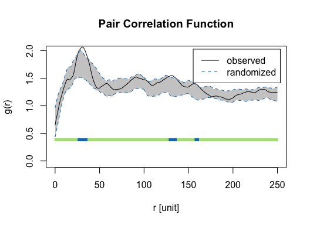

<!-- README.md is generated from README.Rmd. Please edit that file -->

<!-- badges: start -->

| Continuous Integration                                                                                                                                 | Development                                                                                                                        | CRAN                                                                                                                    | License                                                                                                         |
| ------------------------------------------------------------------------------------------------------------------------------------------------------ | ---------------------------------------------------------------------------------------------------------------------------------- | ----------------------------------------------------------------------------------------------------------------------- | --------------------------------------------------------------------------------------------------------------- |
| [](https://github.com/r-spatialecology/shar/actions)        | [](https://www.repostatus.org/#active)                       | [](https://cran.r-project.org/package=shar)                    | [](https://www.gnu.org/licenses/gpl-3.0) |
| [](https://codecov.io/gh/r-spatialecology/shar?branch=main) | [](https://www.tidyverse.org/lifecycle/#stable) | [](http://cran.rstudio.com/web/packages/shar/index.html) |                                                                                                                 |

<!-- badges: end -->


# shar

**S**pecies-**H**abitat **A**ssociations in **R** is a `R` package to
analyze species-habitat associations. Therefore, information about the
location of the species is needed (as a point pattern) and about the
environmental conditions (as a raster map). In order to analyse the data
for significant habitat associations either the location data or the
environmental data is randomized n-times. Then, counts within the
habitats are compared between the randomized data and the observed data.
Positive or negative associations are present if the observed counts is
higher or lower than the randomized counts (using quantile thresholds).
Methods are mainly described in Plotkin et al. (2000), Harms et
al. (2001) and Wiegand & Moloney (2014). **shar** is mainly based on
the [`spatstat`](http://spatstat.org) (Baddeley et al. 2015) and
[`raster`](https://rspatial.org/raster/) (Hijmans 2017) package.

## Installation

You can install the released version of **shar** from
[CRAN](https://cran.r-project.org/web/packages/shar/index.html) with:

``` r
install.packages("shar")
```

And the development version from
[GitHub](https://github.com/r-spatialecology/shar) with:

``` r
# install.packages("devtools")
devtools::install_github("r-spatialecology/shar")
```

This also automatically installs all non-base `R` package dependencies,
namely the following packages: `classInt`, `raster`, `spatstat.core`,
`spatstat.geom`.

## How to use shar

``` r
library(shar)
library(raster)

set.seed(42)
```

**shar** comes with build-in example data sets. `species_a` and
`species_b` are exemplary location of species, e.g. trees, as
`ppp`-objects from the `spatstat` package. `landscape` contains
exemplary continuous environmental data. However, all methods depend on
discrete data. Therefore we need to classify the data first. However,
all methods require “fully mapped data” in a sense that NA cells of the
environmental data are allowed only if simultaneously these areas cannot
accommodate any locations of the point pattern (e.g., a water body
within a forest area). This needs to be reflected in the observation
window of the point pattern. For the torus translation method, no NA
values are allowed at all.

``` r
landscape_classified <- classify_habitats(raster = landscape, classes = 5)
```

There are two possibilities to randomize the environmental data, both
described in Harms et al. (2001). The first shifts the habitat map in
all 4 cardinal directions around a torus. The second one assigns the
habitat values to an empty map using a random walk algorithm. Both
functions return a list with randomized rasters and the observed one.
For more information on the methods, please click
[here](https://r-spatialecology.github.io/shar/articles/articles/background.html).

``` r
torus_trans <- translate_raster(raster = landscape_classified)

random_walk <- randomize_raster(raster = landscape_classified, n_random = 99)
```

``` r
col = c("#440154FF", "#3B528BFF", "#21908CFF", "#5DC863FF", "#FDE725FF")

plot(torus_trans, n = 3, col = col)
```



To randomize the point pattern, either use the Gamma test described by
Plotkin et al. (2000) or pattern reconstruction (Kirkpatrick et
al. 1983; Tscheschel & Stoyan 2006).

``` r
gamma_test <- fit_point_process(pattern = species_b, process = "cluster", n_random = 99)

# (this can takes some time)
reconstruction <- reconstruct_pattern(pattern = species_b, n_random = 99, e_threshold = 0.05)
```

Of course, there are several utility functions. For example, you can
plot a randomized pattern or calculate the differences between the
observed pattern and the randomized patterns (using summary functions).

``` r
plot(reconstruction, verbose = FALSE, ask = FALSE)
```



``` r
calculate_energy(reconstruction, verbose = FALSE)
##  randomized_1  randomized_2  randomized_3  randomized_4  randomized_5 
##    0.04977170    0.04957230    0.04726960    0.04850374    0.04943275 
##  randomized_6  randomized_7  randomized_8  randomized_9 randomized_10 
##    0.04961647    0.04956624    0.04899253    0.04990957    0.04986367 
## randomized_11 randomized_12 randomized_13 randomized_14 randomized_15 
##    0.04950447    0.04874728    0.04929699    0.04946615    0.04920561 
## randomized_16 randomized_17 randomized_18 randomized_19 randomized_20 
##    0.04990415    0.04813098    0.04967062    0.04964872    0.04990442 
## randomized_21 randomized_22 randomized_23 randomized_24 randomized_25 
##    0.04962960    0.04897384    0.04933126    0.04793454    0.04684534 
## randomized_26 randomized_27 randomized_28 randomized_29 randomized_30 
##    0.04937752    0.04901977    0.04727432    0.04872280    0.04909555 
## randomized_31 randomized_32 randomized_33 randomized_34 randomized_35 
##    0.04943618    0.04911176    0.04961079    0.04722192    0.04903119 
## randomized_36 randomized_37 randomized_38 randomized_39 randomized_40 
##    0.04871886    0.04850467    0.04816963    0.04959528    0.04882913 
## randomized_41 randomized_42 randomized_43 randomized_44 randomized_45 
##    0.04992851    0.04971571    0.04823854    0.04926482    0.04919277 
## randomized_46 randomized_47 randomized_48 randomized_49 randomized_50 
##    0.04878647    0.04944433    0.04970445    0.04936347    0.04940492 
## randomized_51 randomized_52 randomized_53 randomized_54 randomized_55 
##    0.04928191    0.04990232    0.04821732    0.04914895    0.04945262 
## randomized_56 randomized_57 randomized_58 randomized_59 randomized_60 
##    0.04935535    0.04945049    0.04945263    0.04968753    0.04908163 
## randomized_61 randomized_62 randomized_63 randomized_64 randomized_65 
##    0.04894439    0.04965690    0.04674924    0.04953226    0.04954639 
## randomized_66 randomized_67 randomized_68 randomized_69 randomized_70 
##    0.04786011    0.04967592    0.04798818    0.04918426    0.04903230 
## randomized_71 randomized_72 randomized_73 randomized_74 randomized_75 
##    0.04844243    0.04979140    0.04890577    0.04944504    0.04892242 
## randomized_76 randomized_77 randomized_78 randomized_79 randomized_80 
##    0.04951001    0.04983087    0.04982151    0.04949764    0.04996596 
## randomized_81 randomized_82 randomized_83 randomized_84 randomized_85 
##    0.04945631    0.04973731    0.04969985    0.04896601    0.04967939 
## randomized_86 randomized_87 randomized_88 randomized_89 randomized_90 
##    0.04681880    0.04999594    0.04845668    0.04816291    0.04884513 
## randomized_91 randomized_92 randomized_93 randomized_94 randomized_95 
##    0.04822789    0.04875104    0.04886014    0.04935561    0.04911822 
## randomized_96 randomized_97 randomized_98 randomized_99 
##    0.04904763    0.04792171    0.04961382    0.04997607
```

The data was created that `species_a` has a negative association to
habitat 4 and `species_b` has a positive association to habitat 5, which
is reflected in the results.

Given the characteristics of the method, a positive association to one
habitat inevitably leads to a negative association to at least one of
the other habitats (and vice versa; Yamada et al. 2006). For example, a
high amount of individual points in the positively associated habitat
simultaneously mean that less individual points can be present in the
other habitats.

Furthermore, please be aware that due to the randomization of the null
model data, results might slightly differ between different
randomization approaches (e.g., `fit_point_process()`
vs. `translate_raster()`) and even for repetitions of the same
approach. Thus, the exact `lo` and `hi` thresholds might be slightly
different when re-running the examples.

However, the counts of the observed data should be identical, and
general results and trends should be similar.

``` r
significance_level <- 0.01

results_habitat_association(pattern = species_a, raster = torus_trans, significance_level = significance_level)
## > Input: randomized raster
## > Quantile thresholds: negative < 0.005 || positive > 0.995
##   habitat count lo hi significance
## 1       1    35 10 35         n.s.
## 2       2    44 19 53         n.s.
## 3       3    36 15 49         n.s.
## 4       4     4 15 58     negative
## 5       5    73 48 90         n.s.

results_habitat_association(pattern = reconstruction, raster = landscape_classified, significance_level = significance_level)
## > Input: randomized pattern
## > Quantile thresholds: negative < 0.005 || positive > 0.995
##   habitat count    lo    hi significance
## 1       1     6 21.96 49.02     negative
## 2       2    18 32.47 64.51     negative
## 3       3    18 26.98 56.10     negative
## 4       4    21 17.98 40.00         n.s.
## 5       5   129 24.96 52.02     positive
```

## Contributing and Code of Conduct

Contributions to **shar** are highly welcomed and appreciated. This
includes any form of feedback, bug reports, feature
requests/suggestions, or general questions about the usage. Please feel
free to either open an
[issue](https://github.com/r-spatialecology/shar/issues/), contact the
authors via [mail](mailto:mhk.hesselbarth@gmail.com), or fork the repo
and raise a pull request.

Please note that the **shar** project is released with a [Contributor
Code of
Conduct](https://contributor-covenant.org/version/2/0/CODE_OF_CONDUCT.html).
By contributing to this project, you agree to abide by its terms.

## References

Baddeley, A., Rubak, E., Turner, R., 2015. Spatial point patterns:
Methodology and applications with R. Chapman and Hall/CRC Press, London.
<isbn:9781482210200>

Harms, K.E., Condit, R., Hubbell, S.P., Foster, R.B., 2001. Habitat
associations of trees and shrubs in a 50-ha neotropical forest plot.
Journal of Ecology 89, 947–959.
<https://doi.org/10.1111/j.1365-2745.2001.00615.x>

Hijmans, R.J., 2019. raster: Geographic data analysis and modeling. R
package version 2.9-5. <https://cran.r-project.org/package=raster>.

Kirkpatrick, S., Gelatt, C.D.Jr., Vecchi, M.P., 1983. Optimization by
simulated annealing. Science 220, 671–680.
<https://doi.org/10.1126/science.220.4598.671>

Plotkin, J.B., Potts, M.D., Leslie, N., Manokaran, N., LaFrankie, J.V.,
Ashton, P.S., 2000. Species-area curves, spatial aggregation, and
habitat specialization in tropical forests. Journal of Theoretical
Biology 207, 81–99. <https://doi.org/10.1006/jtbi.2000.2158>

Tscheschel, A., Stoyan, D., 2006. Statistical reconstruction of random
point patterns. Computational Statistics and Data Analysis 51, 859–871.
<https://doi.org/10.1016/j.csda.2005.09.007>

Wiegand, T., Moloney, K.A., 2014. Handbook of spatial point-pattern
analysis in ecology. Chapman and Hall/CRC Press, Boca Raton.
<isbn:9781420082548>

Yamada, T., Tomita, A., Itoh, A., Yamakura, T., Ohkubo, T., Kanzaki, M.,
Tan, S., Ashton, P.S., 2006. Habitat associations of Sterculiaceae trees
in a Bornean rain forest plot. Journal of Vegetation Science 17,
559–566. <https://doi.org/10.1111/j.1654-1103.2006.tb02479.x>
