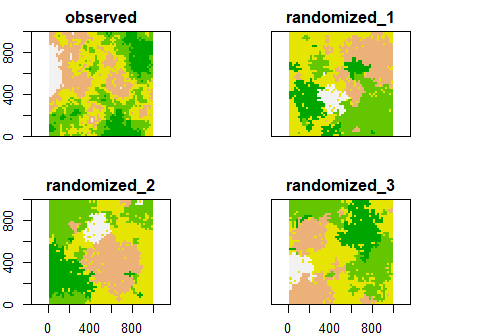

<!-- README.md is generated from README.Rmd. Please edit that file -->

[](https://travis-ci.org/r-spatialecology/SHAR)
[](https://ci.appveyor.com/project/r-spatialecology/SHAR)
[](https://codecov.io/gh/r-spatialecology/SHAR?branch=master)
[](https://www.repostatus.org/#active)
[](https://www.tidyverse.org/lifecycle/#maturing)

# SHAR

**Sp**ecies-**H**abitat **A**ssociations in **R** is a `R` package to
analyze species-habitat associations. Therefore, information about the
location of the species is needed (as a point pattern) and about the
environmental conditions (as a raster map). In order to analyse the data
for significant habitat associations either the location data or the
environmental data is randomized n-times. Then, counts within the
habitats are compared between the randomized data and the observed data.
Positive or negative associations are present if the observed counts is
higher or lower than the randomized counts (using quantile thresholds).
Methods are mainly described in Plotkin et al. (2000), Harms et al.
(2001) and Wiegand & Moloney (2014). SHAR is mainly based on the
`spatstat` (Baddeley et al. 2015) and `raster` (Hijmans 2017) package.

## Installation

You can install the released version of SHAR from
[CRAN](https://CRAN.R-project.org) with:

``` r
install.packages("SHAR") # Nope, not yet...
```

And the development version from [GitHub](https://github.com/) with:

``` r
# install.packages("devtools")
devtools::install_github("r-spatialecology/SHAR")
```

## How to use SHAR

SHAR comes with build-in example data sets. `landscape` contains
examplary continious environmental data. However, all methods depend on
discrete data. Therefore we need to classify the data first.

``` r
library(SHAR)
library(raster)

landscape_classified <- classify_habitats(raster = landscape, classes = 5)
```

`species_a` and `species_b` are examplary location of species,
e.g. trees, as `ppp`-objects from the `spatstat` package.

There are two possibilities to randomize the environmental data, both
described in Harms et al. (2001). The first shifts the habitat map in
all 4 cardinal directions around a torus. The second one assigns the
habitat values to an empty map using a random walk algorithm. Both
functions return a list with randomized rasters and the observed one.

``` r
torus_trans <- translate_raster(raster = landscape_classified)

random_walk <- randomize_raster(raster = landscape_classified, n_random = 19, verbose = FALSE)
```



To randomize the point pattern, either use the Gamma test described by
Plotkin et al. (2000) or pattern reconstruction (Tscheschel & Stoyan
2006).

``` r
gamma_test <- fit_point_process(pattern = species_a, process = "cluster", n_random = 19, verbose = FALSE)

reconstruct <- reconstruct_pattern(pattern = species_b, max_runs = 500, n_random = 19, verbose = FALSE) # takes some time
```

Of coures, there are several utility functions. For example, you can
plot a randomized pattern or calculate the differences between the
observed pattern and the randomized patterns (using summary functions).

``` r
plot_randomized_pattern(reconstruct)
```


``` r

calculate_energy(reconstruct)
#>  randomized_1  randomized_2  randomized_3  randomized_4  randomized_5 
#>    0.05556111    0.05002281    0.06750310    0.06939615    0.06554276 
#>  randomized_6  randomized_7  randomized_8  randomized_9 randomized_10 
#>    0.06704461    0.10196797    0.05777903    0.06533177    0.07226947 
#> randomized_11 randomized_12 randomized_13 randomized_14 randomized_15 
#>    0.05745653    0.05976380    0.05953421    0.06765263    0.05489300 
#> randomized_16 randomized_17 randomized_18 randomized_19 
#>    0.06324396    0.06187737    0.05891777    0.04592981
```

The data was created that `species_a` has a negative association to
habitat 4 and `species_b` has a positive association to habitat 5. At
one point a posititive association to one habitat leads consequently to
a negative association to another habitat (and vice versa). All this can
be seen in the results.

``` r
results_habitat_association(pattern = species_a, raster = torus_trans)
#> > Input: randomized raster | Quantile thresholds: negative < 0.025 - positive > 0.975
#>   habitat count lo hi significance
#> 1       1    10  0  8     positive
#> 2       2    14  8 24         n.s.
#> 3       3    30 14 29     positive
#> 4       4     0 10 26     negative
#> 5       5    14  4 17         n.s.

results_habitat_association(pattern = reconstruct, raster = landscape_classified)
#> > Input: randomized point pattern | Quantile thresholds: negative < 0.025 - positive > 0.975
#>   habitat count    lo    hi significance
#> 1       1     7  1.00 29.10         n.s.
#> 2       2    20 25.90 61.20     negative
#> 3       3    31 46.15 80.10     negative
#> 4       4    33 32.70 69.85         n.s.
#> 5       5   109 12.15 55.25     positive
```

## References

Baddeley, A., Rubak, E., Turner, R. (2015). Spatial Point Patterns:
Methodology and Applications with R. London:Chapman and Hall/CRC Press,
2015.
<http://www.crcpress.com/Spatial-Point-Patterns-Methodology-and-Applications-with-R/Baddeley-Rubak-Turner/9781482210200/>

Harms, K. E., Condit, R., Hubbell, S. P., & Foster, R. B. (2001).
Habitat associations of trees and shrubs in a 50-ha neotropical forest
plot. Journal of Ecology, 89(6), 947-959.

Hijmans, R. J. (2017). raster: Geographic Data Analysis and Modeling. R
package version 2.6-7. <https://CRAN.R-project.org/package=raster>

Plotkin, J. B., Potts, M. D., Leslie, N., Manokaran, N., LaFrankie, J.
V., & Ashton, P. S. (2000). Species-area curves, spatial aggregation,
and habitat specialization in tropical forests. Journal of Theoretical
Biology, 207(1), 81-99.

Tscheschel, A., & Stoyan, D. (2006). Statistical reconstruction of
random point patterns. Computational Statistics and Data Analysis,
51(2), 859-871.

Wiegand, T., & Moloney, K. A. (2014). Handbook of spatial point-pattern
analysis in ecology. Boca Raton: Chapman and Hall/CRC Press.
